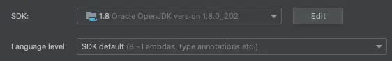
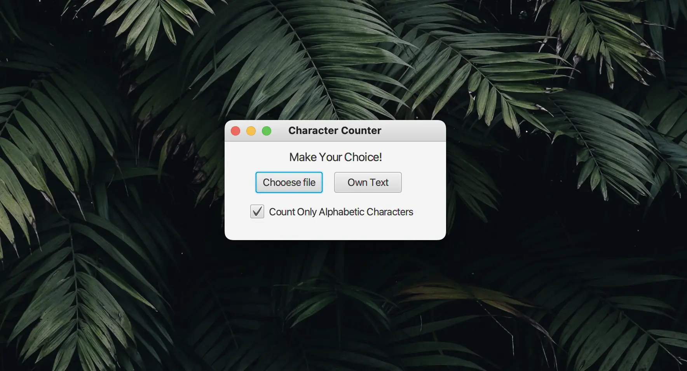
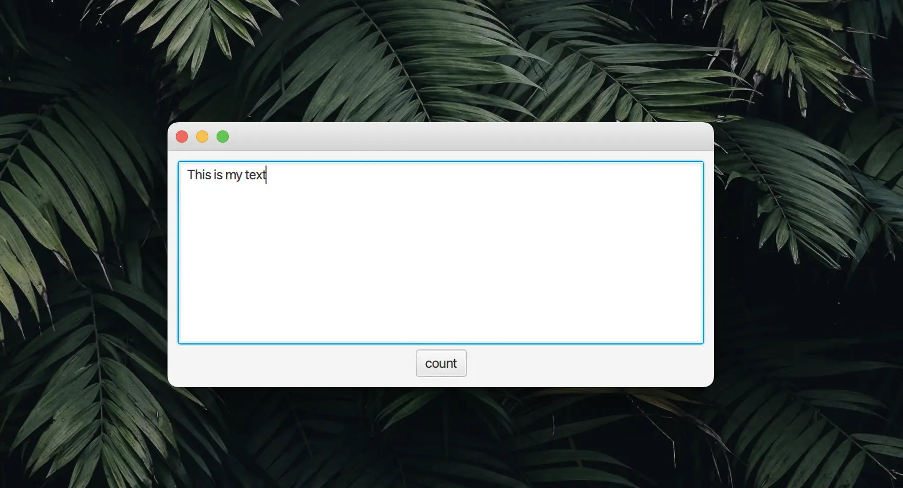
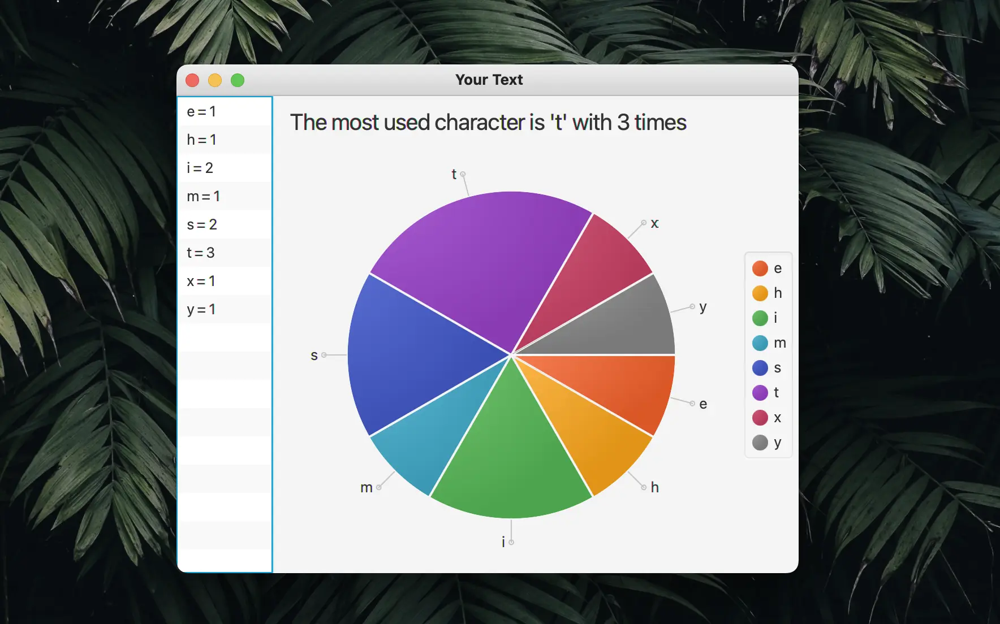
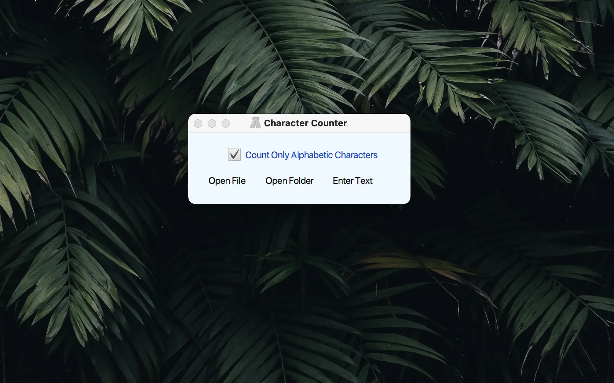
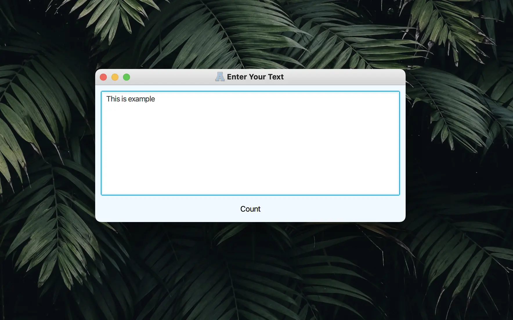
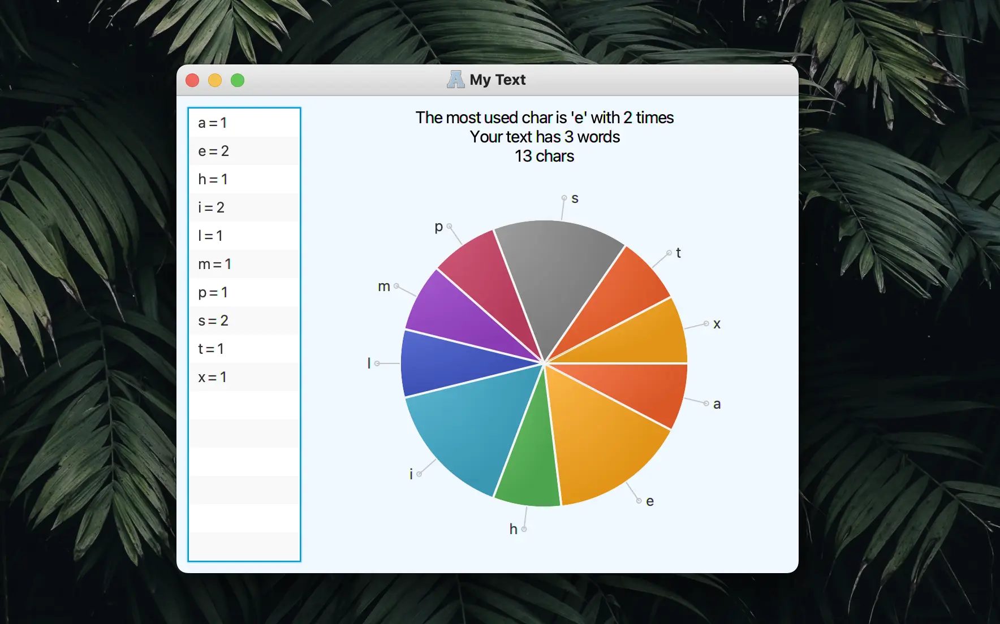

# Character counter
An example JavaFX application which has count characters either on your selected file or custom text and then show number of each character on a pie-chart

You can test both following. There are just a few differences between V1 and V2
* MyCharacterCounterV1
* MyCharacterCounterV2

## NOTE
To run application suggested to use followind JDK

## V1 Screenshots

## V2 Screenshots

